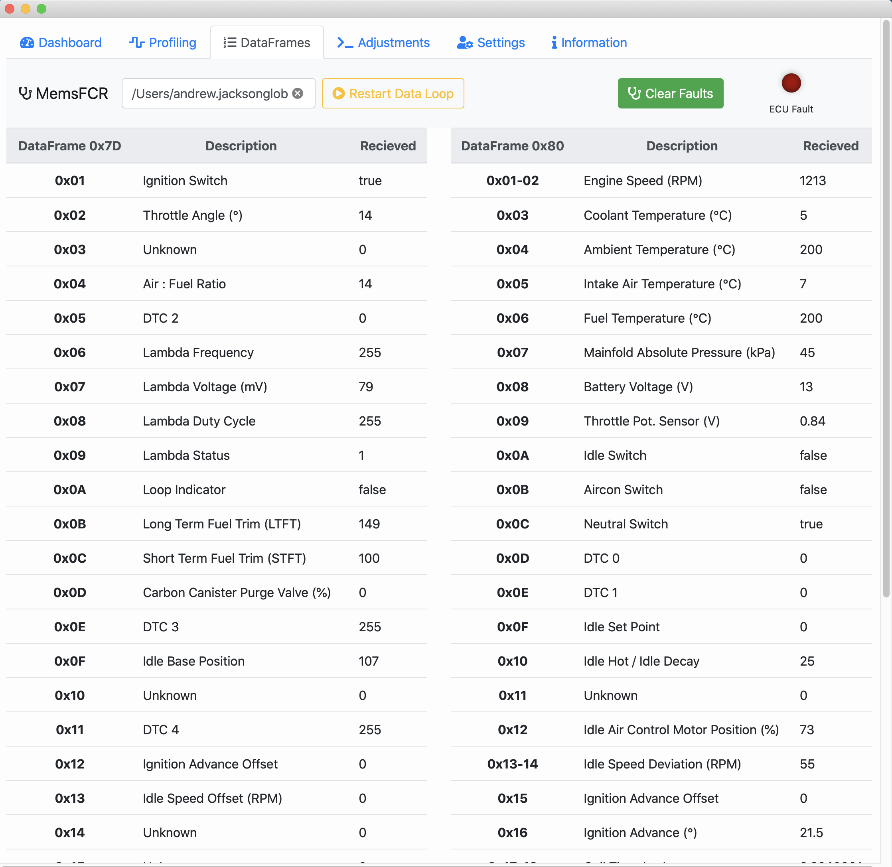

# MemsFCR 
The Mems FCR supports Mac and Windows. The application connects using the serial interface and supports the serial FTDI cables you can purchase for the Android MemsDiag application. Instructions on how to create this cable or alternatively build a bluetooth wireless interface are also included.

All MEMS data points are read and can be viewed directly. If any faults have been detected these will be displayed and can be cleared.

The data can be logged to a CSV file for easy analysis using Excel or Google Sheets.

### The Dashboard

This tab shows the live running parameters from the ECU. If a fault is detected the ECU Fault indicator will light. The list of detected fault codes is displayed below the gauges. Any faults detected can be cleared by clicking Clear Faults.

### Profiling

The profiling shows a running graph of the following metrics:
* Engine RPM
* Lambda Voltage
* Loop Indicator
* Coolant Temperature

These 4 parameters are very important in determining the running condition of the engine and are used a primary parameters by the ECU for adjusting fueling and timing. Status indicators at the top show faults or warnings calculated from expected events of anomalies in the data. 

### Adjustments

* Reset ECU
This resets all adjustments and learnt parameters such as Short and Long Term Fuel Trim. The ECU will re-learn these parameters. 

* Reset Adjustments
Any changes made to the adjustments can be reset by clicking this button.

* Idle Speed
Increases / decreases the idle running speed. Hot idle should settle arounf 850 RPM.
This is a facility which is built into the MEMS ECU to overcome some situations during the service life of a vehicle where it might be wished to eradicate a problem such as a rattle or engine wear by slightly increasing the idle speed of the engine. This offset adds approximately 50 RPM to the Idle target speed. The function can be removed by resetting the adaptive values.

* Idle Hot (Decay) Position
 This is the number of IACV steps from fully closed (0) which the ECU has learned as the correct position to maintain the target idle speed with a fully warmed up engine. If this value is outside the range 10 - 50 steps, then this is an indication of a possible fault condition or poor adjustment. This value can be forced for a short time using this function.

* Fuel Trim
This allows the adjustment of the Long Term Fuel Trim (LTFT) which is used to offset fuel injection of rich or lean running

* Ignition Advance
This is a facility to overcome some situations during the service life of a vehicle where it might be wished to eradicate a problem such as a low octane fuel being constantly used or engine wear by slightly advancing the ignition timing the idle speed of the engine. The function can be removed by resetting the adaptive values.

### Dataframes

A live view of the calculated parameters received from the ECU. Since not all the values in the MEMS dataframe have been mapped this may be updated as more information comes to light.

### Information
Useful information on the operating characteristics of the MEMS ECU

### To Do..
Still to do - the command / response loop can get blocked if multiple overlapping commands are sent. I need to disable the buttons whilst a command is in progress.
